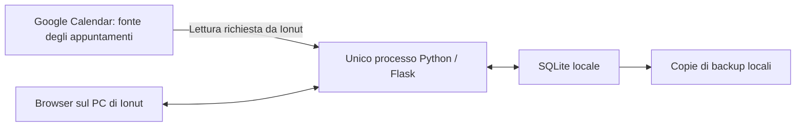

# KITE Admissions — MVP personale locale per Latina

Versione 0.2 · 25 settembre 2026 · **Specifica aggiornata da validare. Nessuna implementazione avviata.**

Questa versione sostituisce la proposta 0.1 e recepisce le cinque decisioni di Ionut: una società, un utilizzatore, applicazione locale, Calendar in sola lettura e offerte senza approvazione fra utenti.

**Finito per questa revisione:** ridurre modello e schermate, definire import/collegamento, offerte comunicate, backup/eliminazione e pochi criteri verificabili. Si modifica soltanto questa specifica: nessun codice, database, account Google, evento, installazione o configurazione del PC.

## 1. Perimetro deciso e semplificazioni

| Aspetto | Decisione recepita | Conseguenza nella V1 |
|---|---|---|
| Organizzazione | LATINA INTERNATIONAL SCHOOL IMPRESA SOCIALE S.R.L. | Un solo contesto: Latina; nessuna tabella società/plessi o separazione multi-tenant |
| Utilizzatore | Solo Ionut sul proprio PC | Nessun account applicativo, ruolo, RBAC o assegnazione a colleghi |
| Appuntamenti | Creati e gestiti in Google Calendar dalla segreteria | Il CRM importa e aggiorna una copia; nessuna scrittura verso Calendar |
| Offerte | Ionut registra e comunica le condizioni | Bozza → “Segna come comunicata”; nessun secondo approvatore |
| Ambiente | PC Windows, applicazione interna, database locale | Browser su loopback, un processo backend e SQLite; nessun hosting cloud |

Rimangono le quattro domande operative: **chi viene, cosa sappiamo, cosa abbiamo detto, cosa facciamo dopo**.

Rispetto alla 0.1 vengono eliminati gestione accessi, permessi per campo/plesso, coda Calendar, pubblicazione eventi, servizi gestiti, audit completo dei cambiamenti, dashboard di conversione, notifiche esterne e approvazione delle proposte. Le tabelle passano da **15 a 7: sei operative e una piccola lista tecnica di esclusioni dall'import**.

Restano utili: famiglia distinta dalle richieste dei figli, offerte precedenti conservate, dati Google separati dalle note locali, timestamp, ricerca dei doppioni e backup. Una futura estensione sarà una modifica esplicita del prodotto, non un'infrastruttura costruita oggi.

## 2. Architettura consigliata e alternative più semplici

**Confermo una piccola applicazione web custom locale: Python + Flask + SQLite, pagine HTML generate dal backend e poco JavaScript.** È una soluzione molto più piccola della precedente proposta.

SQLite è appropriato perché applicazione e database risiedono sullo stesso PC e scrive un solo utilizzatore. Non serve installare o amministrare un server database. È uno degli impieghi descritti dalla [documentazione SQLite](https://www.sqlite.org/whentouse.html).

La freccia Google → app descrive il flusso dei dati: tecnicamente è l'app che effettua richieste di lettura alle API. Le informazioni aggiunte nel CRM non vengono inviate a Google.

| Componente | Scelta proposta |
|---|---|
| Interfaccia | Quattro viste, moduli HTML, nessuna applicazione frontend separata |
| Backend | Flask; accesso SQLite tramite libreria standard Python e query predefinite con parametri |
| Database | Un file SQLite con relazioni, transazioni e versione dello schema; nessun server PostgreSQL |
| Esecuzione Windows | Waitress nello stesso processo applicativo, vincolato a `127.0.0.1`; debug disattivato |
| Avvio | Collegamento “Avvia KITE Admissions”: avvia una sola istanza e apre il browser; un secondo avvio apre quella già attiva |
| Arresto | Azione locale “Chiudi applicazione”; chiudere una scheda del browser non equivale a spegnere il backend |
| Connessione | Internet necessario per autorizzare Google e aggiornare gli appuntamenti; schede, offerte e follow-up utilizzabili offline |

Waitress supporta Windows ed è documentato fra le opzioni di esecuzione Flask; non si usa il server di sviluppo nell'utilizzo quotidiano. [Documentazione Flask](https://flask.palletsprojects.com/en/stable/deploying/waitress/).

La prima installazione dovrà predisporre un ambiente Python isolato e un avvio guidato; l'uso giornaliero non richiede terminale. Le dipendenze saranno fissate a versioni supportate al momento dell'implementazione. Non occorre costruire subito un installer complesso o un eseguibile autoaggiornante.

### Esiste adesso una soluzione ancora più semplice?

| Alternativa | Valutazione per questi requisiti |
|---|---|
| Foglio Excel locale | Più veloce da iniziare, ma import aggiornabile, collegamenti famiglia/evento e versioni delle offerte richiederebbero macro o procedure manuali. Non è più semplice nell'uso quotidiano richiesto |
| Access / database desktop con moduli | Plausibile se già disponibile e mantenuto da qualcuno che lo conosce; OAuth Google e import restano lavoro custom. Non assumo licenza o competenze già presenti |
| AppSheet / low-code cloud | Riduce parte della programmazione, ma non rispetta la scelta di applicazione e database esclusivamente locali |
| File `.ics` importato manualmente | Riduce il setup OAuth, ma esportazione ripetuta e interpretazione delle cancellazioni rendono più debole l'aggiornamento. Non lo sceglierei per il flusso abituale |
| App desktop nativa | Evita il browser ma richiede un'altra interfaccia e packaging; nessun vantaggio necessario per il flusso attuale |

**Scelta:** mantenere il custom locale. Il lavoro essenziale è creare e mantenere i pochi comportamenti richiesti, soprattutto import e backup. Non ci sono servizi cloud applicativi da gestire; rimane la configurazione iniziale dell'accesso Google Calendar in lettura.

## 3. Workflow e schermate realmente necessarie

1. La segreteria crea o modifica l'appuntamento in Google Calendar come oggi.
2. Ionut apre **Oggi** e preme **Aggiorna da Google Calendar**.
3. Gli appuntamenti già importati vengono aggiornati; i nuovi compaiono in un'anteprima dalla quale selezionare quelli Admissions.
4. Ogni evento importato non collegato entra in **Da collegare**. Ionut apre l'evento, collega una famiglia esistente oppure ne crea una da dati proposti e verificati.
5. Nella scheda prepara l'incontro: alunno, anno, classe, provenienza utile e note.
6. Dopo la visita registra un resoconto breve, le condizioni eventualmente comunicate e un prossimo passo.
7. Nei giorni successivi **Oggi** mostra visite, richiami e pratiche dimenticate.

| Vista | Contenuto e azioni |
|---|---|
| **Oggi** | Appuntamenti odierni e prossimi, eventi da collegare, follow-up scaduti/odierni, famiglie da richiamare, pratiche senza prossimo passo; ultimo aggiornamento Calendar visibile |
| **Appuntamenti** | Anteprima import, elenco per data, non collegati/collegati/annullati, dettaglio evento, “Apri in Google Calendar”, resoconto visita |
| **Famiglie** | Ricerca per cognome/etichetta, nome bambino, telefono o email; filtri essenziali per anno/stato e vista archiviate |
| **Scheda famiglia** | Dati minimi, richieste dei figli, appuntamenti, resoconti, offerte, follow-up e cronologia essenziale |

Una piccola pagina **Dati e collegamento Google** raccoglie configurazione Calendar, percorso database, backup, export e ripristino. Non è un pannello amministrativo multiutente.

Creazione famiglia, resoconto, offerta e follow-up sono pannelli nella scheda. Nessuna schermata autonoma per listini, utenti, ruoli, reportistica o configurazione del workflow.

### Campi essenziali e tempi d'uso

- **Famiglia:** etichetta riconoscibile obbligatoria; adulto e almeno un recapito consigliati, non inventati se assenti. Secondo adulto/recapiti, fonte del contatto e note preliminari facoltativi. ID, date e autore automatici.
- **Richiesta alunno:** nome o riferimento provvisorio obbligatorio; anno scolastico, classe/ciclo e provenienza se noti. Niente data di nascita completa obbligatoria; eventuale anno di nascita soltanto se utile.
- **Resoconto:** esito dell'incontro, sintesi dei fatti/domande, eventuali osservazioni personali pertinenti in un campo distinto. Nessuna separazione di permessi. Prossimo passo o chiusura della pratica.
- **Follow-up:** azione, data, nota opzionale. Responsabile implicito: Ionut.

Obiettivo di rapidità: **collegare o creare la famiglia da un evento già importato in circa 60 secondi; resoconto in 1–2 minuti**. La V1 non deve più prenotare nel CRM durante la telefonata della segreteria: quel passaggio rimane in Calendar.

## 4. Google Calendar → CRM: contratto preciso

### 4.1 Accesso e selezione

Nella V1 si configura **un calendario sorgente**, scelto da Ionut fra quelli ai quali ha già accesso. Il CRM non crea calendari, non cambia condivisioni e non invita partecipanti. Non si presume che il calendario contenga soltanto Admissions.

Accesso tramite OAuth per applicazione desktop e browser di sistema. Non è un login al CRM: serve a consentire la lettura del calendario. Usare gli scope `calendar.events.readonly` e, per scegliere il calendario dall'elenco, `calendar.calendarlist.readonly`; nessuno scope di scrittura. Lo scope eventi permette tecnicamente di leggere i calendari accessibili all'account: **la selezione di un solo calendario è anche un vincolo applicativo, non un limite imposto dallo scope**. [Scope Calendar](https://developers.google.com/workspace/calendar/api/auth), [OAuth desktop](https://developers.google.com/identity/protocols/oauth2/native-app).

Configurazione iniziale: progetto/API e client OAuth desktop, account autorizzato e verifica delle eventuali restrizioni Workspace. Nessun acquisto di hosting è implicato. I token vengono protetti nel profilo Windows, esclusi da export e backup dati; su un altro PC si ricollega Google. Non memorizzare la password dell'account.

### 4.2 Pulsante “Aggiorna da Google Calendar”

**Importazione manuale ripetibile, senza scheduler, webhook, code o sincronizzazione incrementale con token.** Una sola operazione attiva alla volta, con avanzamento e riepilogo; le richieste Google hanno timeout. Se la connessione fallisce si riprova esplicitamente dal pulsante, senza servizio in background.

1. Leggere tutti i risultati della finestra scelta, incluse le pagine successive. Finestra proposta: **30 giorni precedenti e 180 successivi**, modificabile prima dell'import. Non significa importare tutto lo storico.
2. Gli eventi già presenti localmente vengono riconosciuti e aggiornati. I nuovi, non cancellati e non esclusi, compaiono in anteprima; **nessuna casella preselezionata**. “Importa selezionati” li salva senza riscrivere titolo, data o descrizione.
3. Per ogni evento già importato che non compare nella lista, leggere il suo ID direttamente. Questo controllo vale anche per eventi ormai fuori dalla finestra e distingue spostamenti, cancellazioni e problemi di accesso.
4. Aggiornare ogni record soltanto sulla base di una risposta riuscita e valida. Errori su un record conservano la sua copia precedente. Il riepilogo distingue aggiornati, invariati, cancellati confermati, nuovi selezionabili e non verificati.
5. Mostrare l'ora dell'ultimo tentativo e dell'ultimo controllo completo. In caso di fallimento parziale non indicare “tutto aggiornato”.

La selezione esplicita evita di importare impegni non Admissions. Gli eventi non selezionati rimangono soltanto nell'anteprima, senza salvarne il contenuto nel database o nei log. “Ignora questo evento” evita di riproporlo; la scelta è revocabile.

Per la prima V1 è accettabile leggere direttamente gli ID importati non restituiti nella finestra: è semplice e non perde cambiamenti storici. Il tempo cresce col numero di eventi conservati; se diventa scomodo nell'uso reale si rivaluta l'algoritmo, senza introdurre ora infrastruttura aggiuntiva.

Google documenta paginazione, intervalli temporali, espansione delle ricorrenze e restituzione degli eventi annullati in [Events: list](https://developers.google.com/workspace/calendar/api/v3/reference/events/list); la verifica puntuale usa [Events: get](https://developers.google.com/workspace/calendar/api/v3/reference/events/get). Le date della finestra sono calcolate in Europe/Rome e convertite correttamente per la richiesta.

### 4.3 Identità, dati e modifiche

La chiave remota è **`(calendar_id, google_event_id)`**, univoca nel database. L'ID interno dell'appuntamento resta stabile. Titolo, telefono, data e `iCalUID` non sono usati da soli per deduplicare.

| Dati Calendar, aggiornabili dall'import | Dati locali, mai sovrascritti dall'import |
|---|---|
| Titolo, inizio/fine, fuso, luogo, descrizione | Collegamento alla famiglia e alla richiesta alunno |
| Recapiti presenti esplicitamente nell'evento | Anagrafica già confermata da Ionut |
| Stato Google, ultima modifica Google, link evento | Preparazione visita, esito effettivo e resoconto |
| Ultima verifica riuscita e disponibilità della sorgente | Offerte, note locali e follow-up |

L'import inserisce o aggiorna per quella chiave. Due clic, un'interruzione o un secondo import non creano una seconda riga. Il nuovo titolo di un evento non cambia automaticamente cognome o telefono della famiglia collegata: i dati sorgente aggiornati sono visibili per una verifica manuale.

Descrizioni HTML sono visualizzate come testo sicuro; nessuno script, immagine remota o collegamento viene eseguito automaticamente. I recapiti sono proposti dai partecipanti o estratti in modo deterministico dal testo, mostrando la provenienza. L'email dell'organizzatore o della segreteria non diventa automaticamente il recapito della famiglia.

Le modifiche a data/ora si applicano alla copia Calendar. La data effettiva di una visita già registrata rimane invariata; se Google sposta un evento dopo il resoconto, la scheda mostra la discrepanza. Un aggiornamento di calendario non rende mai una visita “effettuata”.

### 4.4 Cancellazioni e casi particolari

| Caso | Comportamento locale |
|---|---|
| Google restituisce `status=cancelled` per un evento importato | Segnare **Annullato su Calendar**, toglierlo dagli appuntamenti attesi, conservare collegamenti, resoconto e offerte; mantenere i dati sorgente precedenti se la risposta contiene soltanto l'ID |
| Evento assente dalla finestra | Non dedurre la cancellazione; leggere l'ID e, se spostato, aggiornare data/ora anche fuori finestra |
| Errore 403/404/410, token revocato o rete assente senza conferma esplicita di annullamento | Segnare **Non verificato / sorgente non disponibile**, conservare lo storico e invitare a controllare Calendar; nessuna eliminazione automatica |
| Evento copiato/ricreato con ID nuovo | Proporlo come nuovo; segnalare possibili somiglianze, senza fusione automatica |
| Evento ricorrente | Mostrare le singole occorrenze nella finestra; importare solo quelle selezionate, con ID dell'occorrenza e riferimenti a serie/inizio originale; nessuna prenotazione infinita |
| Evento “tutto il giorno” | Conservare le date e mostrare **Orario da verificare**, senza inventare un'ora; mantenere correttamente la fine esclusiva Google |
| Evento provvisorio/tentative | Mostrarlo **Da confermare**, senza presentarlo come confermato |
| Dati non validi o appuntamento privo di orario utilizzabile | Segnalazione leggibile; nessuna correzione arbitraria |

Gli errori Google non equivalgono tutti alla cancellazione di un evento; la distinzione è coerente con la [documentazione sugli errori API](https://developers.google.com/workspace/calendar/api/guides/errors).

Una cancellazione confermata non chiude la richiesta e non cancella follow-up. Se era l'unico prossimo passo, la pratica compare fra quelle senza azione. Un appuntamento non verificato resta visibile con avviso e non conta come copertura certa del prossimo passo.

Il pulsante **Apri in Google Calendar** è il punto per cambiare orari o annullare. Nessun form locale permette di modificare i campi remoti. Dopo la modifica esterna si preme nuovamente Aggiorna.

## 5. Da evento a famiglia: collegamento e duplicati

Un evento importato può esistere **senza famiglia collegata**. Questo stato è normale e viene evidenziato in Oggi; non si creano famiglie fittizie durante l'import.

### Collega famiglia esistente

1. Aprire l'evento; vedere titolo, data/ora, descrizione e recapiti disponibili.
2. Il pannello propone corrispondenze per telefono/email; permette ricerca per famiglia o bambino.
3. Selezionare la famiglia e, se utile, una richiesta alunno. Se l'incontro riguarda più fratelli, lasciare il collegamento a livello famiglia: non serve una tabella molti-a-molti nella V1.
4. Confermare; i dati Calendar rimangono separati dall'anagrafica.

### Crea famiglia dall'evento

1. Aprire “Crea famiglia”. Recapiti e testo identificativo sono **suggerimenti modificabili**, con riferimento alla sorgente.
2. Confermare un'etichetta famiglia e l'eventuale adulto/recapito corretto. Nessun dato assente viene inventato; “recapito non disponibile” è ammesso.
3. Aggiungere nome/riferimento del bambino e anno/classe se noti, oppure completare prima della visita.
4. Salvare famiglia, eventuale richiesta e collegamento all'evento in una transazione. Un errore non lascia metà della creazione salvata.

**Prevenzione duplicati:** numeri cercati in forma normalizzata, email confrontate per ricerca senza perdere l'originale; nomi simili sono solo suggerimenti. Prima del salvataggio si ripete il controllo. È possibile confermare un nucleo distinto con recapito condiviso: telefono/email non sono chiavi univoche assolute. Nessun dato sensibile viene raccolto per deduplicare.

Se il collegamento è sbagliato, “Cambia collegamento” mostra la famiglia attuale e quella nuova prima di salvare. Se esiste un resoconto, avverte che anche quel resoconto seguirà l'appuntamento; offerte e follow-up non vengono trasferiti automaticamente. La V1 non include fusione di due dossier già popolati.

## 6. Offerte e “Segna come comunicata”

Una proposta appartiene obbligatoriamente a una famiglia e facoltativamente a una sua richiesta alunno. Si possono così registrare una quota per un figlio o una proposta familiare descritta per intero, senza un motore di ripartizione.

**Campi:** retta standard di riferimento, quota proposta, periodicità (annuale/mensile/una tantum), servizi inclusi o aggiuntivi, eventuale sconto, note/condizioni, eventuale validità; data creazione e numero versione automatici. Valuta V1: EUR. Importi salvati in centesimi interi; non sommare automaticamente quote con periodicità diversa.

Se retta standard e proposta hanno la stessa base, lo sconto monetario è la loro differenza; condizioni diverse sono esplicitate nelle note, senza percentuali ambigue. I servizi hanno descrizione, eventuale importo/periodicità e indicazione incluso/aggiuntivo. Ogni versione contiene i valori proposti, senza dipendere da un listino centrale modificabile.

| Stato | Cosa si può fare |
|---|---|
| **BOZZA** | Modificare importi, servizi e note; eliminare la bozza con conferma |
| **COMUNICATA** | Consultare e creare una nuova versione; contenuto economico congelato |
| **RITIRATA** | Consultare proposta, data e motivo del ritiro; nessuna riattivazione implicita |

### Comportamento esatto del pulsante

1. Verifica che famiglia/ambito, quota, periodicità e servizi/condizioni siano comprensibili e salvati. Una proposta familiare non richiede un alunno inventato.
2. Nel medesimo salvataggio passa da BOZZA a COMUNICATA e registra **data/ora dell'operazione**, salvata in UTC e mostrata in Europe/Rome, autore `Ionut` e canale facoltativo.
3. Congela il contenuto e rende quella versione riconoscibile come proposta effettivamente comunicata. Non invia email o messaggi e non modifica Calendar.
4. Un secondo clic o ritentativo lascia invariati data, numero e contenuto: l'operazione è idempotente.

**Nuova proposta:** “Crea nuova versione” copia i dati in una nuova BOZZA collegata alla precedente. La vecchia rimane comunicata e consultabile. Solo quando la nuova viene segnata come comunicata diventa la proposta corrente dello stesso ambito famiglia/richiesta. La prima data di comunicazione non viene sovrascritta da un successivo richiamo.

Ritiro o registrazione errata: si conserva la versione e si aggiungono data/motivo del ritiro. Ritirare la corrente non fa tornare automaticamente valida quella precedente. Per riproporre vecchie condizioni si crea una nuova versione. Nessun “sblocca e modifica” su un'offerta comunicata.

Esempio fittizio: v1 comunicata a 1.000 EUR/anno; v2 in bozza a 900 EUR/anno → la scheda mostra ancora v1 come comunicata. Dopo “Segna come comunicata” su v2, mostra v2 e conserva v1. Nessun approvatore diverso da Ionut.

## 7. Stati, prossimo passo e cronologia minima

Le richieste dei figli hanno **quattro stati**: `IN_CORSO`, `IN_PAUSA`, `ISCRITTO`, `NON_PROSEGUE`. Appuntamento fissato e visita effettuata restano fatti dell'appuntamento; “da richiamare” è un follow-up, non uno stato aggiuntivo.

- IN_CORSO → IN_PAUSA / ISCRITTO / NON_PROSEGUE.
- IN_PAUSA richiede una data di riesame; può tornare IN_CORSO o chiudersi.
- Ionut può rettificare/riaprire una richiesta con una breve nota. ISCRITTO indica una conferma amministrativa effettiva annotata con data/riferimento, non una sola manifestazione d'interesse.
- Per un nuovo anno si crea una nuova richiesta, anche copiando i dati essenziali; non si sovrascrive una pratica conclusa.

**Prossimo passo:** primo follow-up aperto pertinente, prossimo appuntamento non annullato e verificato, oppure data di riesame. Un'azione o incontro collegato alla sola famiglia copre tutte le sue richieste aperte; uno collegato a un figlio copre soltanto quella richiesta. Anche una famiglia ancora senza alunni identificati viene evidenziata se non ha prossimo passo.

FollowUp: APERTO / COMPLETATO / ANNULLATO. “Scaduto” deriva dalla data locale. “Richiamare” identifica le famiglie da richiamare in Oggi. Dopo un appuntamento passato senza esito compare “Resoconto da completare”; il calendario da solo non attesta che la famiglia sia venuta.

La cronologia mostra appuntamenti importati, resoconti, note/comunicazioni, offerte comunicate e follow-up, ricavandoli dalle rispettive registrazioni. Per le transizioni importanti usa inoltre la tabella `Interaction` esistente: **nessuna nuova tabella AuditEvent**. Gli aggiornamenti ordinari mantengono timestamp/autore senza un audit completo dei singoli campi; le offerte comunicate conservano lo storico del §6.

**B1 — Transizioni persistenti.** Nella stessa transazione locale del cambiamento si inserisce una `Interaction` per:

- cancellazione Calendar rilevata e confermata dalla sorgente;
- riattivazione dello stesso evento Calendar, riconosciuto dalla coppia calendario/evento;
- variazione dello stato di `StudentLead`, comprese iscrizione, non prosecuzione e riapertura.

Ogni transizione conserva tipo, riferimento all'oggetto interessato (`appointment_id` oppure `student_lead_id`), timestamp UTC, origine/autore, stato precedente e stato successivo. Per Calendar il timestamp indica quando il CRM ha rilevato il cambiamento, non l'ora presunta della modifica su Google. Un errore di accesso o l'assenza dell'evento dalla finestra non costituiscono conferma di cancellazione.

Si registra una sola riga per transizione effettiva: iscrizione, non prosecuzione e riapertura sono tipi specifici della variazione di stato, non una seconda riga oltre a quella generica. Se lo stato non cambia, un nuovo import o un ritentativo non aggiunge eventi. Cambiamento e registrazione riescono insieme oppure vengono entrambi annullati. Cancellazioni e riattivazioni successive dello stesso evento rimangono distinguibili nello storico, senza sovrascrivere quelle precedenti.

Per un appuntamento non ancora collegato, `Interaction` si riferisce direttamente ad `Appointment` e può avere `family_id` nullo. Quando l'appuntamento viene collegato, quella stessa registrazione è visibile nella scheda famiglia attraverso il collegamento, senza copiarla o ricrearla. Per una transizione di `StudentLead`, richiesta e famiglia devono essere coerenti.

Le registrazioni automatiche delle transizioni restano immutate nelle operazioni ordinarie; resta applicabile la cancellazione definitiva esplicita del dossier prevista al §9.4. **Non si registrano** sincronizzazioni senza cambiamenti, aperture di pagina o modifiche ordinarie dei singoli campi. La timeline non duplica gli eventi già rappresentati dalle registrazioni di appuntamenti, visite, offerte e follow-up.

## 8. Modello dati semplificato

Sei tabelle operative. `PK` = chiave primaria; `FK` = relazione; `*` = obbligatorio. Gli ID interni sono UUID e non dipendono da nomi, recapiti o posizione nelle liste.

Tutte le tabelle operative hanno `created_at*`, `updated_at*`, `created_by*`, `updated_by*`. Autori automatici: `Ionut` o `Calendar import`, etichette operative e non identità autenticate. Timestamp UTC, visualizzazione Europe/Rome. Un contatore di revisione protegge dai salvataggi obsoleti in due schede del browser, senza introdurre multiutenza.

| Tabella | Campi principali e relazioni | Vincoli essenziali |
|---|---|---|
| **Family** | `id*` PK, `display_name*`; adulto principale con telefono/email e forme normalizzate; secondo adulto/recapiti opzionali; fonte contatto, data primo contatto, note preliminari, `archived_at` | Etichetta riconoscibile; recapiti mancanti ammessi ed evidenziati; nessuno stato unico che sovrascriva gli esiti dei fratelli |
| **StudentLead** | `id*` PK, `family_id*` FK, `display_name*` anche provvisorio; anno scolastico, ciclo/classe, provenienza/zona/anno di nascita solo se utili; `status*`, riesame, motivo/data chiusura e riferimento iscrizione | Richiesta di un alunno per un anno, non anagrafica scolastica completa. Richieste simili stessa famiglia/nome/anno segnalate, non fuse automaticamente |
| **Appointment** | `id*` PK; `calendar_id*`, `google_event_id*`; titolo, inizio/fine o date all-day, fuso, descrizione, luogo, recapiti sorgente; stato Google, `google_updated_at`, `last_synced_at`, stato verifica, link; riferimenti ricorrenza; `family_id` FK e `student_lead_id` FK nullable; preparazione, esito visita, `visited_at`, resoconto, osservazioni locali | Unique calendario/evento; importabile senza famiglia; alunno della famiglia collegata; campi Calendar separati dai locali |
| **Offer** | `id*` PK, `family_id*` FK, `student_lead_id` FK opzionale, `version_no*`, `previous_offer_id` FK; retta/quote in centesimi, EUR, periodicità, servizi strutturati, note, validità; `status*`, `communicated_at`, canale, ritiro/data/motivo | Versioni univoche nello stesso ambito famiglia/richiesta, inclusa richiesta nulla; predecessore stesso ambito; una bozza corrente per ambito; contenuto congelato da COMUNICATA |
| **FollowUp** | `id*` PK, `family_id*` FK, `student_lead_id` FK opzionale; `action*`, `due_on*`, nota, `status*`, data/esito completamento | Responsabile implicito Ionut; scadenza obbligatoria; completamento non inventa una telefonata riuscita |
| **Interaction** | `id*` PK, `family_id` FK, `student_lead_id` FK opzionale, `appointment_id` FK opzionale; tipo nota/telefonata/email/rettifica oppure transizione del §7, `occurred_at*`, `text*`; origine/autore; stato precedente e successivo obbligatori per le transizioni; eventuale riferimento offerta | Comunicazioni manuali e transizioni importanti persistenti, salvate insieme al cambiamento; famiglia obbligatoria salvo registrazioni riferite direttamente ad Appointment, anche non ancora collegato; nessuna integrazione email o log completo dei campi |

Due semplificazioni deliberate:

- **StudentLead incorpora AdmissionCase**: una riga per figlio/anno. Se il figlio torna in un altro anno, si crea un'altra richiesta; non servono oggi identità scolastiche riutilizzabili fra società e plessi.
- **Visit è incorporata in Appointment**: un incontro ha un solo resoconto corrente. Modifiche riportano autore/data; una rettifica importante può essere descritta nella cronologia. Nessun versionamento completo dei resoconti come per le offerte.

La famiglia mantiene al massimo due gruppi di contatti nel modulo, evitando la tabella Contact in questa V1. Un incontro familiare può riguardare più fratelli senza enumerarli in un collegamento molti-a-molti; le informazioni specifiche rimangono nelle rispettive richieste. Nessun funnel deve attribuire automaticamente la visita a ogni bambino.

**Settima tabella, tecnica: CalendarExclusion.** PK composta `calendar_id + google_event_id`; motivo `IGNORED` o `FAMILY_DELETED`, data. Conserva soltanto gli identificativi necessari a non riproporre lo stesso evento, senza titolo, descrizione, nomi o recapiti. Gli identificativi restano dati tecnici protetti, non si dichiarano “anonimi”.

**Configurazione locale non segreta:** nome scuola, autore Ionut, calendario selezionato, finestra import, stato ultimo aggiornamento e versione schema. Un piccolo file di configurazione è sufficiente; nessuna tabella utenti o piattaforma di impostazioni. Backup include la configurazione; token OAuth esclusi.

Le relazioni famiglia/figlio sono controllate sul server e con FK SQLite abilitate su ogni connessione. Le operazioni composte usano transazioni. Anche con un solo utente, doppio clic e due schede del browser non devono duplicare offerte o sovrascrivere senza avviso dati già cambiati.

## 9. Database locale, backup, export ed eliminazione

### 9.1 Dove risiedono i dati

Percorsi **proposti, non creati in questa revisione**:

- Database: `C:\Users\ionut\AppData\Local\KITEAdmissions\data\admissions.sqlite3`.
- Configurazione non segreta: `C:\Users\ionut\AppData\Local\KITEAdmissions\settings.json`.
- Backup: `C:\Users\ionut\AppData\Local\KITEAdmissions\backups\`.

La pagina Dati mostra il percorso assoluto effettivo e “Apri cartella dati”. Il database attivo rimane fuori da cartelle cloud sincronizzate e condivisioni di rete. Codice e dati sono separati, così un aggiornamento dell'app non sostituisce l'archivio.

SQLite ordinario non cifra automaticamente il file. La protezione si appoggia all'account Windows personale, ai permessi della cartella e alla cifratura del dispositivo, da verificare sul PC. Database, backup ed export contengono dati personali e richiedono la stessa cautela.

### 9.2 Backup locale semplice

- **Automatico dopo ogni salvataggio locale concluso e a fine import**: una copia giornaliera aggiornata, scritta prima su file temporaneo e poi sostituita atomicamente. Non una nuova copia per ogni clic.
- **Copia separata prima di eliminazione definitiva o aggiornamento dello schema**: se fallisce, l'azione distruttiva non procede. Prima del ripristino, la copia preventiva è richiesta quando il database corrente è presente, leggibile e integro; se è assente o corrotto/non leggibile si applica l'eccezione B2 descritta sotto.
- **Pulsante “Crea backup ora”** per una copia nominata con data/ora e per copiarla su un supporto scelto da Ionut.
- Finestra proposta: **30 giorni** per copie automatiche e pre-operazione; mantenere comunque l'ultima copia valida. Le copie manuali sono gestite esplicitamente da Ionut.
- Mostrare ultima copia riuscita ed errori. Un errore dopo un normale salvataggio non finge di annullare il dato già salvato: “Dati salvati, backup non riuscito”.

Usare l'API di backup SQLite, disponibile anche come `sqlite3.Connection.backup()` in Python, e verificare l'integrità della copia. **Non copiare alla cieca il solo file `.sqlite3` mentre è aperto**, ignorando eventuali file journal/WAL. La copia deve essere autonoma e ripristinabile. [SQLite Backup API](https://www.sqlite.org/backup.html), [backup Python](https://docs.python.org/3/library/sqlite3.html#sqlite3.Connection.backup).

Il backup sullo stesso disco protegge da diversi errori operativi, ma non dalla perdita del PC/disco. Raccomando una copia periodica su **supporto esterno cifrato**, senza imporre cloud o sincronizzazione automatica nella V1. La destinazione reale viene scelta da Ionut; non se ne inventa una.

**B2 — Ripristino, anche con database corrente assente o corrotto:**

1. Selezionare il backup e mostrarne data/versione. Prima di sostituire qualsiasi dato, verificare che sia apribile, integro, privo di violazioni delle foreign key e con schema compatibile. Un backup non valido non viene usato.
2. Sospendere scritture e import. Se il database corrente è presente, leggibile e integro, crearne e verificare la copia preventiva; se questa fallisce, non sostituire il database sano. Se i controlli rivelano corruzione, anche quando il file è apribile, applicare invece il punto 3.
3. Se il database corrente è assente, procedere senza copia preventiva. Se è corrotto/non leggibile, preservare separatamente il file esistente quando tecnicamente possibile, senza richiederne l'integrità. L'impossibilità di produrne una copia valida o di preservarlo non deve di per sé bloccare il ripristino da un backup valido; segnalare l'eventuale mancata preservazione.
4. Chiudere le connessioni, ripristinare database e configurazione coerente con il backup scelto, quindi riaprire il database.
5. Prima di riprendere l'uso normale, verificare integrità SQLite, foreign key e dati attesi del backup: famiglie/richieste, appuntamenti e resoconti, versioni delle offerte, follow-up, Interaction ed esclusioni Calendar. La prova di ripristino su dati sintetici deve confrontare valori e relazioni attesi, non soltanto accertare che esista un file o che l'app si avvii. In caso di verifica fallita non dichiarare il ripristino riuscito e non riabilitare import o scritture.

Nessuna riga di comando nell'uso ordinario. Questa eccezione riguarda soltanto il recupero da un backup già verificato; non elimina la copia preventiva richiesta per le normali eliminazioni e migrazioni.

Il ripristino ritorna a uno stato precedente: possono riapparire record eliminati dopo la copia e mancare dati recenti. La procedura lo segnala e richiede verifica delle cancellazioni successive **prima di riprendere import e uso normale**. La V1 non promette una riapplicazione automatica di tutte le cancellazioni se il disco originale è perso.

### 9.3 Export

Pulsante **Esporta dati**: pacchetto locale con CSV leggibili delle tabelle operative e JSON completo con ID, relazioni, versioni offerte, esclusioni e configurazione non segreta. Escaping dei CSV per evitare esecuzione involontaria di formule nei fogli di calcolo. Nessun invio, caricamento o collegamento pubblico; token esclusi.

L'export serve a consultare/riutilizzare i dati e riduce il lock-in. Per ripristinare l'app si usa il backup verificato; la V1 non include un importatore generico di CSV modificati esternamente.

### 9.4 Archiviare ed eliminare una famiglia

**Archivia** è l'azione normale e reversibile: nasconde dai flussi attivi senza perdere lo storico. Le famiglie archiviate rimangono ricercabili tramite filtro; import successivi non le riattivano automaticamente. Eventuali appuntamenti futuri rimangono segnalati in Oggi, con badge “Famiglia archiviata”.

**Elimina definitivamente** è separata: mostra famiglia e conteggio di richieste, appuntamenti, resoconti, offerte e attività coinvolti; richiede di digitare l'etichetta famiglia; crea la copia pre-operazione; elimina in una transazione tutti i dati locali del dossier.

Gli ID degli eventi collegati vengono inseriti in CalendarExclusion: quegli stessi eventi non devono essere reimportati o riproposti automaticamente. Una nuova identità evento creata successivamente in Google è un nuovo candidato e richiede comunque selezione umana; non esiste riconoscimento automatico della persona cancellata.

**Google Calendar non viene modificato:** eliminare localmente non elimina dati presenti in Google. Lo segnala il riepilogo. Backup precedenti e copie esportate possono ancora contenere il dossier; hanno conservazione separata e non vengono dichiarati cancellati dal pulsante.

Questo è uno strumento di eliminazione locale, non una garanzia di cancellazione forense da ogni supporto o applicazione. Un eventuale adempimento formale privacy richiederà di verificare anche Calendar, backup ed export.

## 10. Protezione proporzionata e verifiche future

Nessun RBAC, login multiutente o approvazione. Rimangono alcune protezioni minime del programma locale:

- ascolto solo su `127.0.0.1`, mai `0.0.0.0`, indirizzo LAN o tunnel pubblico;
- nessuna API pubblica, CORS aperto, debug console o dati personali nei log tecnici;
- controlli Host/Origin e protezione CSRF sulle modifiche: una pagina web esterna non deve poter invocare cancellazioni sul programma locale;
- cookie/sessione tecnica locale senza gestione account; modifiche mai tramite semplici link GET;
- testi resi sicuri, query parametrizzate, validazione dei campi sul backend;
- token Google protetti nel profilo Windows e revocabili; nessuna credenziale in codice, export o backup dati.

Il confine è l'account Windows di Ionut: chi usa la stessa sessione del PC può potenzialmente accedere ai dati. Il programma senza login non promette isolamento da altre persone che usino quel medesimo account. Bloccare la sessione quando il PC è incustodito.

Raccogliere solo dati utili al contatto/visita: niente documenti d'identità, codice fiscale, dati bancari, reddito, diagnosi o vicende familiari nelle note. Se Calendar contiene informazioni superflue, evitare di selezionare quegli eventi e correggere il contenuto alla sorgente. Nessuna AI esterna per estrarre dati o valutare famiglie.

L'uso locale riduce l'infrastruttura, non azzera gli obblighi relativi ai dati personali. Nella V1: informativa e finalità appropriate al processo reale, riesame manuale delle pratiche chiuse, eliminazione dei dati non più necessari. Nessun motore di retention, procedura DPO nell'app o scadenza di legge inventata. Backup ed export rientrano nel riesame. Sono principi da applicare proporzionatamente, secondo la [guida EDPB](https://www.edpb.europa.eu/sme_en).

**Prima di altri utenti, accesso online, nuove integrazioni o più dispositivi** rivalutare autenticazione, permessi, perimetro della condivisione, conservazione, audit, backup, responsabilità sui fornitori e conflitti. L'unica integrazione V1 è la lettura Calendar descritta. Prima di una futura anonimizzazione va progettata la rimozione anche dei testi liberi e dei collegamenti identificativi: sostituire un cognome non basta.

## 11. Criteri di accettazione V1 — dieci prove essenziali

Queste sono prove del prodotto da costruire, **non test già superati**.

| ID | Prova | Risultato necessario |
|---|---|---|
| AC01 | Avvio locale | Un collegamento apre l'app sul PC con una sola istanza e database identificabile; nessun accesso LAN, login multiutente o servizio cloud; dossier utilizzabile senza rete |
| AC02 | Import in sola lettura | Da un calendario misto si importano soltanto gli eventi selezionati, con ID/titolo/date/descrizione/recapiti presenti/stato/ultima verifica; tutte le pagine lette; nessuna chiamata di creazione/modifica/cancellazione Google |
| AC03 | Aggiornamento robusto | Due import e un ritentativo non duplicano; spostamento anche fuori finestra aggiornato; cancellazione confermata e successiva riattivazione dello stesso evento conservano il dossier e registrano ciascuna una sola Interaction nella transazione del cambiamento, anche senza famiglia ancora collegata; errore/revoca non cancella; ricorrenza e all-day non producono orari o eventi inventati |
| AC04 | Evento → famiglia | Collegare scheda o crearla dai suggerimenti; ricerca per recapiti/nome bambino; doppione segnalato; dati mancanti ammessi; in cinque casi sintetici ordinari Ionut completa il collegamento/creazione entro circa 60 secondi ciascuno, escluso il tempo rete dell'import |
| AC05 | Scheda e resoconto | Due fratelli con richieste/esiti distinti; resoconto in 1–2 minuti senza ricopiare dati; aggiornamenti Google non cambiano anagrafica confermata, esito visita o note locali; variazioni di stato, iscrizione, non prosecuzione e riapertura conservano tipo, oggetto, timestamp, origine/autore e stati precedente/successivo in Interaction atomiche e persistenti, senza duplicati o eventi per sincronizzazioni invariate, aperture di pagina e modifiche ordinarie dei campi |
| AC06 | Offerte | “Segna come comunicata” registra una sola data/ora e congela il contenuto anche con doppio clic; nuova versione conserva la precedente e non cambia la corrente finché bozza; nessuna approvazione fra utenti o invio esterno |
| AC07 | Oggi | Appuntamenti, eventi da collegare, scaduti/odierni e richiami; completate fuori dagli aperti; annullare la sola visita prevista evidenzia la pratica senza prossimo passo; ultima verifica Calendar ed errori visibili |
| AC08 | Backup e ripristino | Copia coerente con database in uso ed errori segnalati; copia pre-operazione obbligatoria per eliminazioni/migrazioni e per restore con database corrente leggibile e integro; restore da backup verificato possibile anche con database corrente assente o corrotto/non leggibile, preservando l'esistente quando tecnicamente possibile senza renderlo un blocco; dopo il restore integrità, foreign key, valori e relazioni attesi di dossier, offerte, timeline, attività ed esclusioni verificati, con avviso sui dati/cancellazioni successivi alla copia |
| AC09 | Export ed eliminazione | Export completo senza token; archiviazione reversibile; cancellazione con conferma rimuove il dossier locale; gli stessi eventi esclusi non ricreano dati al nuovo import; nessuna modifica a Google |
| AC10 | Integrità e protezione locale | Nessuna creazione a metà; collegamenti famiglia/figlio incoerenti respinti; salvataggi obsoleti da due schede segnalati; testo Calendar non esegue codice; modifiche da pagine web esterne e accessi fuori loopback respinti |

Il dataset di prova è sintetico, piccolo e rappresentativo del lavoro di Ionut. Non servono test da piattaforma multiutente o un benchmark da 10.000 famiglie.

**Stop:** a criteri concordati verificati si chiude la V1. Nessuna integrazione successiva viene aggiunta automaticamente.

## 12. FUORI DALLA V1

- Altri plessi/società, multi-tenancy, User/Campus/UserCampus, ruoli e permessi per campo.
- Login applicativo multiutente, SSO aziendale per l'app, approvazioni fra persone.
- Creazione, modifica, cancellazione o inviti Google Calendar dal CRM; sincronizzazione bidirezionale.
- Import automatico non selezionato di tutto un calendario, classificazione AI degli eventi, webhook, scheduler, code, CalendarJob ed event bus.
- Docker, Kubernetes, PostgreSQL, hosting cloud, servizi separati, accesso remoto/LAN e sincronizzazione fra PC.
- Audit completo prima/dopo, versionamento completo di ogni resoconto, motore GDPR/retention e anonimizzazione automatica. Rimangono timestamp, eliminazione locale e versioni delle offerte.
- Motore listini/sconti, fatturazione, incassi, contratti, firme, portale famiglia e gestionale scolastico.
- Gmail, Jotform, Drive, invio automatico di email/SMS e integrazioni ulteriori.
- Dashboard di conversione/BI, scoring, notifiche esterne, app mobile nativa e frontend separato.
- Migrazione massiva dello storico, fusione dei dossier duplicati e import di CSV modificati esternamente.
- Allegati sanitari, documenti d'identità, dati sensibili superflui e elaborazioni tramite servizi AI.

## 13. Validazione richiesta e prossima azione

Le cinque decisioni preliminari sono **recepite** e non vengono riproposte come domande aperte. La raccomandazione aggiornata è: **app web locale + backend unico + SQLite; import manuale ripetibile e selettivo da Calendar; sei tabelle operative; quattro viste; offerte congelate alla comunicazione**.

Restano da fornire al momento della configurazione il calendario sorgente/account autorizzato e l'eventuale destinazione per la seconda copia di backup. Non impediscono di validare il processo e non giustificano architetture alternative costruite in anticipo.

Questa specifica deve essere validata da Ionut **prima di implementare**, come richiesto. Dopo la validazione si potrà delimitare la prima Issue/equivalente approvato secondo il protocollo Ionut; questa revisione non avvia sviluppo, installazioni o collegamenti Google.
